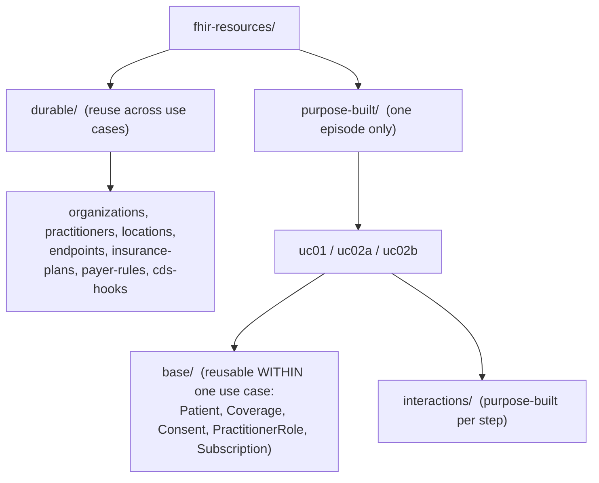

# FHIR Resources Library

Loadable FHIR R4 test data for the OHIA CMS Connectathon. The library is split at the top level into two buckets so you can tell at a glance what is reusable from what is tied to a single patient's story:

| Bucket | Folder | Reusable? | What lives here |
|---|---|---|---|
| **Durable** | [`durable/`](durable/) | Yes, across every use case | Real-world (or stably-synthetic) institutions, clinicians, plans, and payer rules. Tied to the entity, not the story: an `Organization`, `Practitioner`, `Location`, `Endpoint`, `InsurancePlan`, the payer's CRD/DTR rule set (`PlanDefinition`/`Library`/`Questionnaire`), and CDS Hooks discovery configs. |
| **Purpose-built** | [`purpose-built/`](purpose-built/) | No, one episode only | Everything specific to one patient's episode, grouped by use case. Within each use case there are two sub-tiers: `base/` (reusable *within* that one use case) and `interactions/` (built for one specific step). |



## The three tiers, precisely

1. **Durable** (`durable/`) - tied to a real-world institution / clinician / plan, so the same file is loaded by any use case that involves that entity. Example: `org-south-congress-dental` and `pract-maxil` are loaded by both UC02a and UC02b.
2. **Use-case base** (`purpose-built/<uc>/base/`) - the stable fixtures of one patient's episode: the `Patient`, their `Coverage`, `Consent`, the `PractitionerRole` pairings for this episode, and the patient-app `Subscription`. Reused across every interaction of that use case, but **not** across use cases (e.g. Frank Castle is modeled separately in `uc02a/base` and `uc02b/base` because his coverage differs).
3. **Per-interaction** (`purpose-built/<uc>/interactions/interaction-0N/`) - the transactional content of one integration point: `Encounter`, `Condition`, `ServiceRequest`, `Task`, `Procedure`, etc., plus a self-contained transaction `Bundle`.

## Load order

Durable first, then a use case's base, then the interaction you want:

```
durable/**                                   (load once; shared by everything)
purpose-built/<uc>/base/**                    (the episode's fixtures)
purpose-built/<uc>/interactions/interaction-0N/**   (the step under test)
```

Or just load the interaction's `interaction-0N-bundle.json` - each is **self-contained** (it inlines the durable + base + prior-interaction resources it needs, via `urn:uuid` fullUrls and logical references, so a single bundle load reproduces the full state at that interaction).

## Durable manifest (what is reusable, and who uses it)

Note: practitioner/role files are named for the fictional identity they contain (e.g. `pract-whitfield.json`), matching the resource `id` and every reference across the library.

### Organizations - `durable/organizations/`
| File | Real-world entity | Used by |
|---|---|---|
| `org-fccc.json` | Fox Chase Cancer Center (oncology) | UC01 |
| `org-ibx.json` | Independence Blue Cross (medical payer) | UC01 |
| `org-penndental.json` | Penn Dental Medicine | UC01 |
| `org-dentaquest.json` | DentaQuest (TX Medicaid dental payer) | UC02a |
| `org-south-congress-dental.json` | South Congress Dental Care (general dentistry, fictional) | UC02a, UC02b |
| `org-austin-oral-surgery.json` | Austin Oral Surgery (real USOSM partner) | UC02a, UC02b |
| `org-commercial-dental-ppo.json` | Commercial Dental PPO (synthetic payer) | UC02b |

### Practitioners - `durable/practitioners/`
| File | Display (content) | Role | Used by |
|---|---|---|---|
| `pract-whitfield.json` | Dr. Marcus Whitfield, MD | Radiation Oncology | UC01 |
| `pract-osei.json` | Dr. Renata Osei, MD, FACS | Surgical Oncology | UC01 |
| `pract-bellweather.json` | Dr. Andrew Bellweather, DMD | Oral Medicine | UC01 |
| `pract-nandakumar.json` | Priya Nandakumar, MS | Medical Physics (DDC data) | UC01 |
| `pract-parker.json` | Dr. Mary Parker, DDS | General Dentistry | UC02a, UC02b |
| `pract-maxil.json` | Dr. Alex Maxil, DDS, MD | Oral & Maxillofacial Surgery | UC02a, UC02b |

### Locations - `durable/locations/`
| File | Entity | Used by |
|---|---|---|
| `loc-fccc-radonc.json` | FCCC Radiation Oncology | UC01 |
| `loc-penndental.json` | Penn Dental Medicine | UC01 |
| `loc-south-congress-dental.json` | South Congress Dental Care | UC02a, UC02b |
| `loc-austin-oral-surgery.json` | Austin Oral Surgery - Central Austin | UC02a, UC02b |

### Endpoints - `durable/endpoints/`
`endpoint-fccc`, `endpoint-ibx`, `endpoint-penndental` (UC01); `endpoint-dentaquest` (UC02a); `endpoint-south-congress-dental`, `endpoint-austin-oral-surgery` (UC02a, UC02b); `endpoint-commercial-dental-ppo` (UC02b). One FHIR/WADO-RS endpoint per participating organization.

### Insurance plans - `durable/insurance-plans/`
| File | Plan | Used by |
|---|---|---|
| `insplan-ibx-pc65ppo.json` | IBX Personal Choice 65 PPO (medical) | UC01 |
| `insplan-tx-medicaid-adult-dental.json` | Texas Medicaid Adult Dental | UC02a |
| `insplan-commercial-dental-ppo.json` | Commercial Dental PPO | UC02b |

### Payer rules - `durable/payer-rules/` (`plan-definitions/`, `libraries/`, `questionnaires/`)
| Payer / rule | Files | Used by |
|---|---|---|
| IBX IMRT prior-auth (CRD + DTR) | `plandef-ibx-imrt-pa-rule`, `lib-ibx-imrt-pa-logic`, `questionnaire-ibx-imrt-pa-dtr` | UC01 |
| DentaQuest D7210 prior-auth (CRD + DTR) | `plandef-dentaquest-d7210-pa-rule`, `lib-dentaquest-d7210-pa-logic`, `questionnaire-dentaquest-d7210-pa-dtr` | UC02a |
| Commercial no-PA determination (CRD only, no DTR) | `plandef-commercial-noauth-rule`, `lib-commercial-noauth-logic` | UC02b |

### CDS Hooks discovery configs - `durable/cds-hooks/`
Not FHIR resources (flagged in-file). One `order-sign` service config per payer: `cds-hooks-discovery-ibx.json` (UC01), `cds-hooks-discovery-dentaquest.json` (UC02a), `cds-hooks-discovery-commercial.json` (UC02b).

## Purpose-built index

| Use case | Folder | Story | Interactions built |
|---|---|---|---|
| **UC01** | [`purpose-built/uc01-medical-to-dental/`](purpose-built/uc01-medical-to-dental/) | Medical-to-dental referral, head & neck cancer (John Smith), with prior auth | I1-I4 |
| **UC02a** | [`purpose-built/uc02a-surgical-extraction/`](purpose-built/uc02a-surgical-extraction/) | TX Medicaid surgical extraction (Frank Castle), **with** prior auth | I1-I5 |
| **UC02b** | [`purpose-built/uc02b-commercial-implant/`](purpose-built/uc02b-commercial-implant/) | Commercial surgical extraction + immediate implant (Frank Castle), **no** prior auth | I1-I5 |

See [`durable/README.md`](durable/README.md) and [`purpose-built/README.md`](purpose-built/README.md) for tier-specific detail, and each use case's `interactions/README.md` for per-interaction resource lists.

## Naming note
UC01 practitioner/role files are named for their fictional identities - `pract-whitfield`/`role-whitfield`, `pract-nandakumar`/`role-nandakumar`, `pract-osei`/`role-osei`, `pract-bellweather`/`role-bellweather` - with filenames, resource `id`s, and every reference all in agreement. (Earlier revisions kept pre-v3.7 real surnames as the filenames/ids; that was resolved in v5.2, along with aligning the `given` names Marcus / Renata / Andrew that had lingered from before fictionalization.)
